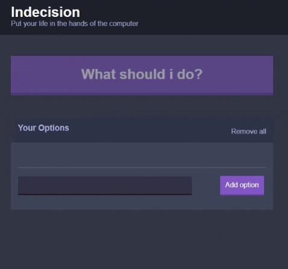

# react-add-option-app


> A simple "Add option" app, with React.



### Getting started
```sh
# Clone the repository
git clone https://github.com/pankaryp/react-add-option-app.git
cd react-add-option-app

# Install npm dependencies
npm install

# Run webpack server
npm run dev-server
```


## License

This project is licensed under the MIT License - see the [LICENSE.md](LICENSE.md) file for details.

